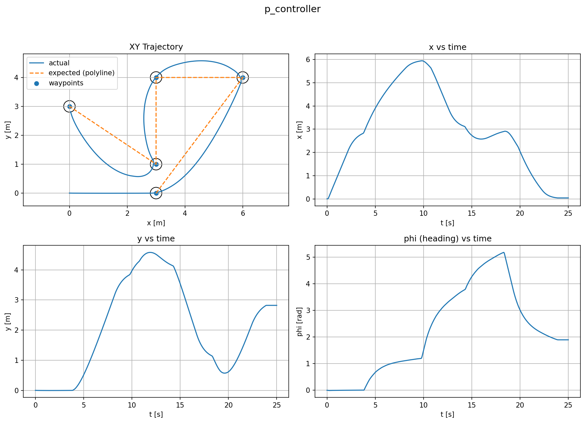
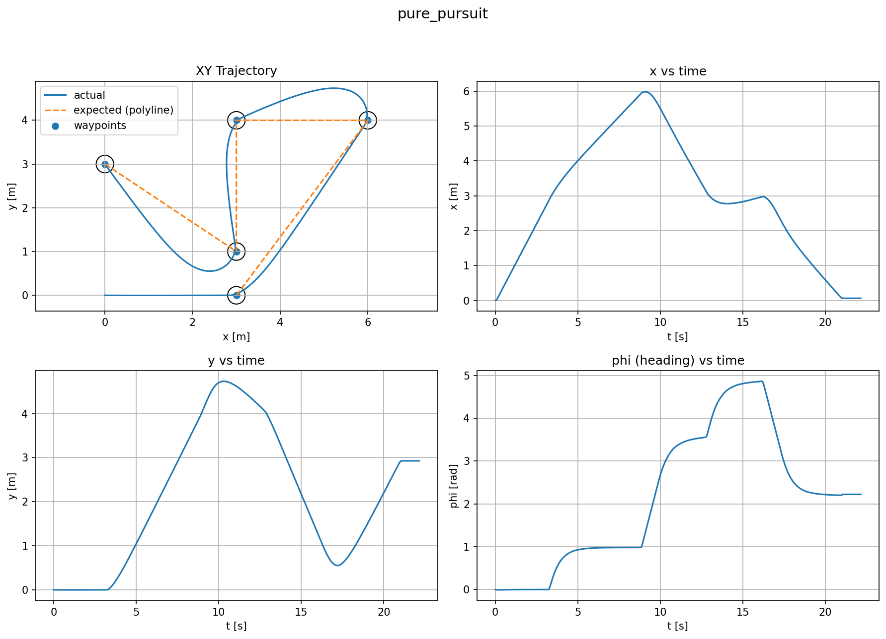
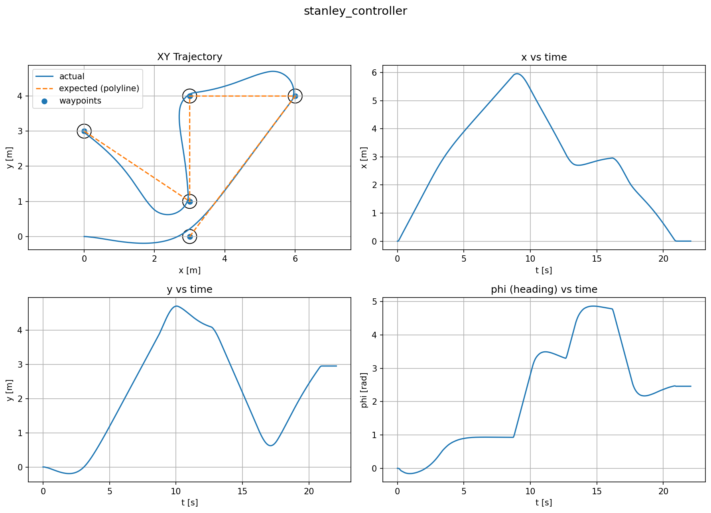

# Differential Drive Robot — ROS 2 Controllers + Plots

Repository contains a differential-drive robot model for Gazebo (ROS 2 Humble) and four simple path-following controllers:
- **P waypoint controller**
- **Pure Pursuit**
- **Stanley**
- **MPC (minimal brute-force grid)**

Each controller can be launched together with an **odometry plotter** that saves a 2×2 figure:
1) XY trajectory (actual vs expected waypoint polyline + tolerance circles)  
2) x(t)  
3) y(t)  
4) heading ϕ(t)

Plots are saved into `./plots/`.

---

## Repository structure

- `my_robot_description/` — URDF/Xacro + meshes + RViz config  
- `my_robot_bringup/` — Gazebo launch (`my_robot_gazebo.launch.xml`), keyboard control, odom listener  
- `my_robot_controllers/` — controllers + plotter + launch files
  - controllers: `p_controller.py`, `pure_pursuit_controller.py`, `stanley_controller.py`, `mpc_controller.py`
  - plotter: `odom_plotter.py`
  - launches: `*_with_plots.launch.py`
- `plots/` — saved plot images (example runs)

---

## Controllers overview

### P (waypoint-to-waypoint)
Moves to the current waypoint using:
- linear speed proportional to distance error (`k_rho * rho`)
- angular speed proportional to heading error (`k_alpha * alpha`)
Optionally slows down when heading error is large (to avoid “driving sideways”).




### Pure Pursuit
Chooses a **lookahead point** on the path at distance `Ld` and computes curvature:
- `kappa = 2*sin(alpha) / Ld`
- `w = v * kappa`
Works well for smooth paths; can cut corners if lookahead is too large.



### Stanley
Uses:
- heading error to the path direction
- cross-track error (signed distance to closest point on the path)
Steering:
- `delta = e_psi + atan2(k * e_cte, v + v0)`
Then mapped to diff-drive angular velocity via `w = (v/L)*tan(delta)` (with a clamp on `delta`).




### MPC (minimal)
Very simple MPC-like selection:
- pick a target waypoint (nearest + a few points ahead)
- brute-force a small grid of constant `(v,w)` commands for horizon `N`
- simulate kinematic rollout and choose the lowest cost


---

## Quick start (Docker)

### 1) Clone
```bash
git clone git@github.com:Artyom35689/AutMobRob-Assignment1.git
cd AutMobRob-Assignment1
````

### 2) Build + start container

```bash
docker compose build
docker compose up -d
```

### 3) Open shell in container

```bash
docker compose exec terminal bash
```

### 4) Build workspace

```bash
cd ~/ros2_ws
colcon build
. install/setup.bash
```

### 5) Run controller + plots (one of)

```bash
ros2 launch my_robot_controllers p_with_plots.launch.py
ros2 launch my_robot_controllers pure_pursuit_with_plots.launch.py
ros2 launch my_robot_controllers stanley_with_plots.launch.py
ros2 launch my_robot_controllers mpc_with_plots.launch.py
```

After completion the plot will appear in `./plots/` on the host.

---

## Run without Docker (host Ubuntu 22.04 + ROS 2 Humble)

### 1) Clone and build

```bash
git clone git@github.com:Artyom35689/AutMobRob-Assignment1.git
cd AutMobRob-Assignment1
colcon build
. install/setup.bash
```

### 2) Launch controller + plots

Same commands as above.

---

## Parameters (most useful)

All controllers share:

* `odom_topic` (default `/odom`)
* `cmd_vel_topic` (default `/cmd_vel`)
* `waypoints_flat` (default polyline in code)
* `v_max`, `w_max`
* `control_rate`

Plotter:

* `plot_name` — name used in the figure title and filename prefix
* `output_dir` — where to save plots (default points to repo `plots/`)
* `goal_tolerance`
* stop detection: `stop_lin_eps`, `stop_ang_eps`, `settle_time`
* safety: `max_duration`

---

## Example output plots

See `./plots/`:

* `run_p_controller_done_*.png`
* `run_pure_pursuit_done_*.png`
* `run_stanley_controller_done_*.png`
* `run_mpc_controller_done_*.png`
